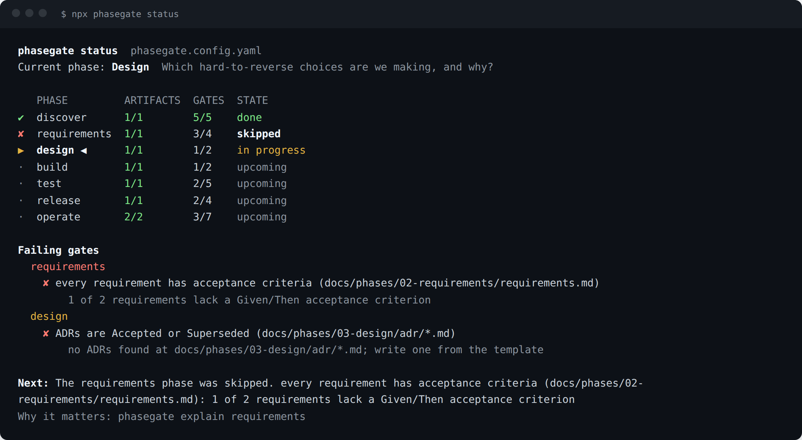

# phasegate

[](https://github.com/MarwanMaher0/phasegate/actions/workflows/ci.yml)
[](https://github.com/MarwanMaher0/phasegate/actions/workflows/phasegate.yml)


A CLI and GitHub Action that walks a software project through its phases, from discover to operate. It
writes short, guided documents for each phase, explains why each phase exists, and fails CI when a phase
the team has already moved past is not actually done.



## The problem

Projects rarely fail during the build. They fail in the phases people skip:

- nobody wrote down what "done" means, so the feature is finished and still wrong;
- a hard-to-reverse decision was made in a pull request comment and nobody remembers why;
- the release went out with no rollback plan, and the first incident is also the first rehearsal.

Teams know these steps matter. The documents exist, as empty templates. phasegate checks them, the same
way a linter checks code, and it teaches the reasoning behind each phase to people who have not been
burned yet.

## Install

```bash
npm install --save-dev github:MarwanMaher0/phasegate#v0.1.0
```

Node 20 or later. No network access and no telemetry.

## Quickstart

```bash
npx phasegate init                 # config + one guided template per phase
npx phasegate status               # where the project stands
npx phasegate next                 # the single most important missing thing
npx phasegate explain requirements # why the phase exists and how teams skip it
npx phasegate check                # for CI: exit 1 if an earlier phase is incomplete
```

`init --profile small` writes one short document per phase, for side projects. The default `standard`
profile adds an ADR folder, a test plan, a release checklist, a runbook and a post-incident template.

Fill in the documents. Text inside `<!-- guidance comments -->` does not count, so a section that still
only holds the template's guidance is reported as empty. When `phasegate next` says a phase is complete,
move `current:` forward in the config.

## The phase model

| Phase | Question it answers | What it produces | How teams skip it |
|---|---|---|---|
| discover | Is this problem worth solving, for whom, and how will we know it worked? | Problem statement with success metrics | Start from a solution and never define success |
| requirements | What exactly must the system do? | Requirements with Given/When/Then criteria | Write requirements nobody can test |
| design | Which hard-to-reverse choices are we making, and why? | Architecture Decision Records | Decide in chat and lose the reasoning |
| build | Is the work done by an agreed definition? | Definition-of-done checklist | "Done" means "merged" |
| test | How will we know each requirement works? | Test plan mapped to requirements | Test what is easy, not what matters |
| release | Can we undo it, see it, and tell people? | Release checklist with rollback steps | Ship on a Friday with no way back |
| operate | Can someone else keep it running? | Runbook and post-incident template | The runbook lives in one person's head |

Run `phasegate explain <phase>` for the full reasoning. Phases are configurable: rename, remove or add
your own, and point a phase at your own teaching file with `guide:`.

## How `check` decides

`current:` names the phase the team is working in. `check` enforces every phase **before** it, because
those are supposed to be finished. The current phase is shown but may be incomplete. `--phase <id>`
checks one phase only. Gates are `required` by default; `level: recommended` gates only fail with
`--strict`.

Exit codes: `0` passed, `1` gates failing, `2` usage or configuration error.

## Gate types

| Type | Passes when | Keys |
|---|---|---|
| `file-exists` | the file, or at least one glob match, exists | `path`, `exclude` |
| `section` | the heading exists and holds content other than guidance comments | `path`, `heading`, `exclude` |
| `acceptance-criteria` | every requirement heading has a Given and a Then | `path`, `pattern` (default `^REQ-\d+`), `exclude` |
| `adr-status` | every ADR's status is allowed | `path`, `allowed` (default Accepted, Superseded), `exclude` |
| `checklist` | every `- [ ]` item is ticked | `path`, `exclude` |
| `no-todo` | no markers are left, outside comments and code | `path`, `markers` (default TODO, TBD, FIXME), `exclude` |
| `command` | a shell command exits 0 | `run`, `timeout` (seconds, default 300) |

Every gate also accepts `level`, `name` and `hint`. Paths support `*`, `?` and `**`. Command gates run in
`check` only; `status` and `next` skip them unless you pass `--run-commands`, so reading status never runs
arbitrary commands.

## Configuration

```yaml
version: 1
current: design

phases:
  - id: requirements
    artifacts: [docs/phases/requirements.md]
    gates:
      - type: acceptance-criteria
        path: docs/phases/requirements.md
      - type: section
        path: docs/phases/requirements.md
        heading: Non-goals
        hint: List what this project will deliberately not do.

  - id: design
    guide: docs/our-design-process.md   # optional: your own teaching content
    gates:
      - type: adr-status
        path: docs/adr/*.md
        exclude: [template.md]
```

Invalid configs fail with every problem listed at once, with "did you mean" suggestions for typos.

## GitHub Action

```yaml
name: phasegate
on: [push, pull_request]
jobs:
  gates:
    runs-on: ubuntu-latest
    steps:
      - uses: actions/checkout@v4
      - uses: MarwanMaher0/phasegate@v0
        # with:
        #   phase: release      # check one phase only
        #   strict: true        # recommended gates fail too
        #   config: ci/phasegate.config.yaml
```

Failing gates become file annotations on the pull request, and the job summary shows a table of every
enforced gate. This repository runs the Action on its own phase documents in
[`docs/phases/`](docs/phases/).

## Development

```bash
npm ci
npm run lint && npm run typecheck && npm test
npm run build   # bundles dist/cli.js and dist/action.js; commit dist/ for the Action
```

## License

MIT
